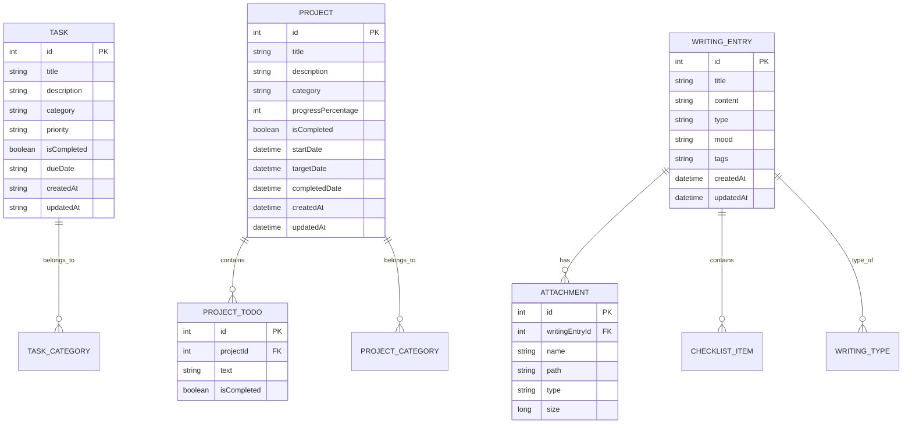

# PathX - Technical Implementation Guide
## IB IA Technical Documentation

---

## Table of Contents
1. [System Architecture](#system-architecture)
2. [Database Design](#database-design)
3. [Core Components](#core-components)
4. [Key Algorithms](#key-algorithms)
5. [Implementation Challenges](#implementation-challenges)
6. [Code Examples](#code-examples)
7. [Testing Documentation](#testing-documentation)
8. [Performance Analysis](#performance-analysis)

---

## System Architecture

### MVVM Architecture Implementation

The PathX app follows the Model-View-ViewModel (MVVM) architecture pattern:

```
┌─────────────────┐    ┌─────────────────┐    ┌─────────────────┐
│      View       │    │   ViewModel     │    │      Model      │
│  (Composables)  │◄──►│  (DataManager)  │◄──►│   (Database)    │
│                 │    │                 │    │                 │
│ • DashboardScreen│    │ • State Management│   │ • Room Database │
│ • PlannerScreen  │    │ • Business Logic │   │ • Entities      │
│ • ProjectsScreen │    │ • Data Binding   │   │ • DAOs          │
│ • ReadingScreen  │    │ • Notifications  │   │ • TypeConverters│
│ • WritingScreen  │    │                 │    │                 │
└─────────────────┘    └─────────────────┘    └─────────────────┘
```

### Component Hierarchy

```
MainActivity
├── AppContent
│   ├── WelcomeScreen (First Launch)
│   └── PathXBottomNavigation
│       ├── DashboardScreen
│       ├── PlannerScreen
│       ├── ProjectsScreen
│       ├── ReadingScreen
│       └── WritingScreen
└── Notification System
    ├── NotificationManager
    ├── NotificationScheduler
    ├── NotificationReceiver
    └── NotificationService
```

---

## Database Design

### Entity Relationships



### Database Schema Implementation

#### Task Entity
```kotlin
@Entity(tableName = "tasks")
data class Task(
    @PrimaryKey(autoGenerate = true)
    val id: Int = 0,
    val title: String,
    val description: String? = null,
    val category: String = "General",
    val priority: Priority = Priority.MEDIUM,
    val isCompleted: Boolean = false,
    val dueDate: String? = null,
    val createdAt: String = LocalDateTime.now().toString(),
    val updatedAt: String = LocalDateTime.now().toString()
)
```

#### Project Entity
```kotlin
@Entity(tableName = "projects")
data class Project(
    @PrimaryKey(autoGenerate = true)
    val id: Int = 0,
    val title: String,
    val description: String,
    val category: ProjectCategory,
    val progressPercentage: Int = 0,
    val isCompleted: Boolean = false,
    val startDate: LocalDateTime = LocalDateTime.now(),
    val targetDate: LocalDateTime? = null,
    val completedDate: LocalDateTime? = null,
    val createdAt: LocalDateTime = LocalDateTime.now(),
    val updatedAt: LocalDateTime = LocalDateTime.now()
)
```

#### Writing Entry Entity
```kotlin
@Entity(tableName = "writing_entries")
data class WritingEntry(
    @PrimaryKey(autoGenerate = true)
    val id: Int = 0,
    val title: String,
    val content: String,
    val type: WritingType,
    val mood: String? = null,
    val tags: String = "", // JSON string of list
    val attachments: String = "", // JSON string of list
    val checklists: String = "", // JSON string of list
    val createdAt: LocalDateTime = LocalDateTime.now(),
    val updatedAt: LocalDateTime = LocalDateTime.now()
)
```

### Type Converters

```kotlin
@TypeConverter
fun fromLocalDateTime(date: LocalDateTime?): String? {
    return date?.toString()
}

@TypeConverter
fun toLocalDateTime(dateString: String?): LocalDateTime? {
    return dateString?.let { LocalDateTime.parse(it) }
}

@TypeConverter
fun fromList(value: List<String>): String {
    return Gson().toJson(value)
}

@TypeConverter
fun toList(value: String): List<String> {
    return try {
        Gson().fromJson(value, object : TypeToken<List<String>>() {}.type)
    } catch (e: Exception) {
        emptyList()
    }
}
```

---

## Core Components

### 1. DataManager (Centralized State Management)

```kotlin
object DataManager {
    // Shared data collections
    private val _tasks = mutableStateListOf<Task>()
    private val _projects = mutableStateListOf<Project>()
    private val _writingEntries = mutableStateListOf<WritingEntry>()
    
    // Reactive getters
    fun getTasks(): List<Task> = _tasks.toList()
    fun getProjects(): List<Project> = _projects.toList()
    fun getWritingEntries(): List<WritingEntry> = _writingEntries.toList()
    
    // CRUD operations
    fun addTask(task: Task) {
        _tasks.add(task)
    }
    
    fun updateTask(updatedTask: Task) {
        val index = _tasks.indexOfFirst { it.id == updatedTask.id }
        if (index != -1) {
            _tasks[index] = updatedTask
        }
    }
    
    fun deleteTask(taskId: Int) {
        _tasks.removeAll { it.id == taskId }
    }
    
    fun toggleTaskCompletion(taskId: Int) {
        val index = _tasks.indexOfFirst { it.id == taskId }
        if (index != -1) {
            _tasks[index] = _tasks[index].copy(
                isCompleted = !_tasks[index].isCompleted,
                updatedAt = LocalDateTime.now().toString()
            )
        }
    }
}
```

### 2. Notification System Architecture

#### NotificationManager
```kotlin
class PathXNotificationManager(private val context: Context) {
    companion object {
        const val CHANNEL_ID_TASKS = "task_notifications"
        const val CHANNEL_ID_PROJECTS = "project_notifications"
        const val CHANNEL_ID_GENERAL = "general_notifications"
        
        const val NOTIFICATION_ID_TASK_DUE = 1000
        const val NOTIFICATION_ID_TASK_OVERDUE = 2000
        const val NOTIFICATION_ID_PROJECT_DUE = 3000
        const val NOTIFICATION_ID_DAILY_REMINDER = 4000
    }
    
    init {
        createNotificationChannels()
    }
    
    private fun createNotificationChannels() {
        if (Build.VERSION.SDK_INT >= Build.VERSION_CODES.O) {
            val taskChannel = NotificationChannel(
                CHANNEL_ID_TASKS,
                "Task Notifications",
                NotificationManager.IMPORTANCE_HIGH
            ).apply {
                description = "Notifications for task deadlines and reminders"
            }
            
            val projectChannel = NotificationChannel(
                CHANNEL_ID_PROJECTS,
                "Project Notifications", 
                NotificationManager.IMPORTANCE_DEFAULT
            ).apply {
                description = "Notifications for project deadlines and reminders"
            }
            
            val generalChannel = NotificationChannel(
                CHANNEL_ID_GENERAL,
                "General Notifications",
                NotificationManager.IMPORTANCE_DEFAULT
            ).apply {
                description = "General app notifications and daily reminders"
            }
            
            val notificationManager = context.getSystemService(Context.NOTIFICATION_SERVICE) as NotificationManager
            notificationManager.createNotificationChannel(taskChannel)
            notificationManager.createNotificationChannel(projectChannel)
            notificationManager.createNotificationChannel(generalChannel)
        }
    }
}
```

#### NotificationScheduler
```kotlin
class NotificationScheduler(private val context: Context) {
    private val alarmManager = context.getSystemService(Context.ALARM_SERVICE) as AlarmManager
    private val notificationManager = PathXNotificationManager(context)
    
    fun scheduleTaskNotifications(task: Task) {
        if (task.dueDate == null || task.isCompleted) return
        
        val dueDate = LocalDateTime.parse(task.dueDate!!)
        
        // Schedule notification for due date (9 AM on due date)
        scheduleNotification(
            taskId = task.id,
            title = "Task Due Today",
            message = "${task.title} is due today",
            notificationTime = dueDate.toLocalDate().atTime(9, 0),
            notificationId = PathXNotificationManager.NOTIFICATION_ID_TASK_DUE + task.id
        )
        
        // Schedule overdue notification (9 AM the day after due date)
        val overdueDate = dueDate.plusDays(1).toLocalDate().atTime(9, 0)
        scheduleNotification(
            taskId = task.id,
            title = "Task Overdue",
            message = "${task.title} is overdue",
            notificationTime = overdueDate,
            notificationId = PathXNotificationManager.NOTIFICATION_ID_TASK_OVERDUE + task.id
        )
    }
    
    private fun scheduleNotification(
        taskId: Int,
        title: String,
        message: String,
        notificationTime: LocalDateTime,
        notificationId: Int
    ) {
        val calendar = Calendar.getInstance().apply {
            val instant = notificationTime.atZone(ZoneId.systemDefault()).toInstant()
            timeInMillis = instant.toEpochMilli()
        }
        
        val intent = Intent(context, NotificationReceiver::class.java).apply {
            action = "SHOW_NOTIFICATION"
            putExtra("notification_id", notificationId)
            putExtra("title", title)
            putExtra("message", message)
            putExtra("task_id", taskId)
        }
        
        val pendingIntent = PendingIntent.getBroadcast(
            context,
            notificationId,
            intent,
            PendingIntent.FLAG_UPDATE_CURRENT or PendingIntent.FLAG_IMMUTABLE
        )
        
        // Use setExactAndAllowWhileIdle for better reliability on newer Android versions
        if (Build.VERSION.SDK_INT >= Build.VERSION_CODES.M) {
            alarmManager.setExactAndAllowWhileIdle(
                AlarmManager.RTC_WAKEUP,
                calendar.timeInMillis,
                pendingIntent
            )
        } else {
            alarmManager.setExact(
                AlarmManager.RTC_WAKEUP,
                calendar.timeInMillis,
                pendingIntent
            )
        }
    }
}
```

### 3. File Attachment System

#### FileTypeUtils
```kotlin
object FileTypeUtils {
    private val supportedExtensions = setOf(
        // Images
        "jpg", "jpeg", "png", "gif", "bmp", "webp",
        // Documents
        "pdf", "doc", "docx", "txt", "rtf", "odt",
        // Spreadsheets
        "xls", "xlsx", "csv", "ods",
        // Presentations
        "ppt", "pptx", "odp",
        // Audio
        "mp3", "wav", "aac", "ogg", "m4a",
        // Video
        "mp4", "avi", "mov", "wmv", "mkv",
        // Archives
        "zip", "rar", "7z",
        // Code
        "java", "kt", "js", "html", "css", "xml", "json"
    )
    
    fun isFileSupported(fileName: String): Boolean {
        val extension = getFileExtension(fileName)
        return extension in supportedExtensions
    }
    
    fun getFileExtension(fileName: String): String {
        return fileName.substringAfterLast('.', "").lowercase()
    }
    
    fun getAttachmentType(fileName: String): AttachmentType {
        val extension = getFileExtension(fileName)
        return when (extension) {
            in listOf("jpg", "jpeg", "png", "gif", "bmp", "webp") -> AttachmentType.IMAGE
            in listOf("mp3", "wav", "aac", "ogg", "m4a") -> AttachmentType.AUDIO
            in listOf("mp4", "avi", "mov", "wmv", "mkv") -> AttachmentType.VIDEO
            in listOf("pdf", "doc", "docx", "txt", "rtf", "odt") -> AttachmentType.DOCUMENT
            else -> AttachmentType.OTHER
        }
    }
}
```

---

## Key Algorithms

### 1. Progress Calculation Algorithm

```kotlin
fun calculateProjectProgress(project: Project): Int {
    if (project.todos.isEmpty()) return 0
    
    val completedTodos = project.todos.count { it.isCompleted }
    val totalTodos = project.todos.size
    
    return ((completedTodos.toFloat() / totalTodos.toFloat()) * 100).toInt()
}

fun calculateReadingProgress(book: Book): Int {
    if (book.totalPages <= 0) return 0
    
    return ((book.pagesRead.toFloat() / book.totalPages.toFloat()) * 100).toInt()
}
```

### 2. Task Filtering and Sorting Algorithm

```kotlin
fun getFilteredTasks(
    tasks: List<Task>,
    category: String,
    sortBy: SortOption = SortOption.DUE_DATE
): List<Task> {
    var filteredTasks = tasks
    
    // Filter by category
    if (category != "All") {
        filteredTasks = filteredTasks.filter { it.category == category }
    }
    
    // Sort tasks
    filteredTasks = when (sortBy) {
        SortOption.DUE_DATE -> filteredTasks.sortedBy { 
            it.dueDate?.let { date -> LocalDateTime.parse(date) } ?: LocalDateTime.MAX 
        }
        SortOption.PRIORITY -> filteredTasks.sortedBy { it.priority.ordinal }
        SortOption.CATEGORY -> filteredTasks.sortedBy { it.category }
        SortOption.CREATION_DATE -> filteredTasks.sortedByDescending { 
            LocalDateTime.parse(it.createdAt) 
        }
    }
    
    return filteredTasks
}
```

### 3. Notification Scheduling Algorithm

```kotlin
fun scheduleSmartNotifications(task: Task) {
    val dueDate = LocalDateTime.parse(task.dueDate!!)
    val now = LocalDateTime.now()
    
    // Calculate time until due date
    val timeUntilDue = Duration.between(now, dueDate)
    val daysUntilDue = timeUntilDue.toDays()
    
    when {
        daysUntilDue == 0L -> {
            // Due today - schedule for 9 AM
            scheduleNotification(dueDate.toLocalDate().atTime(9, 0), "Task Due Today")
        }
        daysUntilDue == 1L -> {
            // Due tomorrow - schedule for 9 AM tomorrow
            scheduleNotification(dueDate.minusDays(1).atTime(9, 0), "Task Due Tomorrow")
        }
        daysUntilDue in 2..7 -> {
            // Due within a week - schedule reminder
            scheduleNotification(dueDate.minusDays(1).atTime(9, 0), "Task Due Soon")
        }
        daysUntilDue > 7 -> {
            // Due in more than a week - no immediate notification
            return
        }
        else -> {
            // Overdue - schedule overdue notification
            scheduleNotification(now.plusHours(1), "Task Overdue")
        }
    }
}
```

---

## Implementation Challenges

### 1. Cross-Screen Data Synchronization

**Challenge**: Ensuring data consistency across different screens and maintaining reactive UI updates.

**Solution**: Implemented DataManager singleton with reactive state management:
```kotlin
object DataManager {
    private val _tasks = mutableStateListOf<Task>()
    
    fun addTask(task: Task) {
        _tasks.add(task)
        // Trigger UI updates automatically through Compose's reactive system
    }
}
```

### 2. File Attachment Handling

**Challenge**: Supporting multiple file types with proper validation and error handling.

**Solution**: Created comprehensive file type detection system:
```kotlin
fun handleFileAttachment(uri: Uri, context: Context): Attachment? {
    return try {
        val fileName = getFileName(uri, context)
        val fileType = FileTypeUtils.getAttachmentType(fileName)
        
        if (!FileTypeUtils.isFileSupported(fileName)) {
            throw UnsupportedFileException(fileName)
        }
        
        val filePath = copyFileToInternalStorage(uri, context)
        Attachment(
            name = fileName,
            path = filePath,
            type = fileType,
            size = getFileSize(uri, context)
        )
    } catch (e: Exception) {
        Log.e("FileAttachment", "Error handling file: ${e.message}")
        null
    }
}
```

### 3. Notification Reliability

**Challenge**: Ensuring notifications appear at correct times, especially on newer Android versions with battery optimization.

**Solution**: Used `setExactAndAllowWhileIdle` and proper notification channels:
```kotlin
if (Build.VERSION.SDK_INT >= Build.VERSION_CODES.M) {
    alarmManager.setExactAndAllowWhileIdle(
        AlarmManager.RTC_WAKEUP,
        calendar.timeInMillis,
        pendingIntent
    )
}
```

### 4. UI State Management

**Challenge**: Managing complex UI states across multiple screens with proper lifecycle handling.

**Solution**: Used Compose's state management with proper scoping:
```kotlin
@Composable
fun PlannerScreen() {
    var showAddTaskDialog by remember { mutableStateOf(false) }
    var editingTask by remember { mutableStateOf<Task?>(null) }
    
    // State management with proper lifecycle
    DisposableEffect(Unit) {
        onDispose {
            // Cleanup when screen is disposed
        }
    }
}
```

---

## Code Examples

### 1. Custom Composable Component

```kotlin
@Composable
fun TaskCard(
    task: Task,
    onToggleComplete: () -> Unit,
    onEdit: () -> Unit,
    onDelete: () -> Unit,
    onView: () -> Unit
) {
    Card(
        modifier = Modifier
            .fillMaxWidth()
            .padding(8.dp)
            .clickable { onView() },
        elevation = CardDefaults.cardElevation(defaultElevation = 4.dp)
    ) {
        Column(
            modifier = Modifier.padding(16.dp)
        ) {
            Row(
                modifier = Modifier.fillMaxWidth(),
                horizontalArrangement = Arrangement.SpaceBetween,
                verticalAlignment = Alignment.CenterVertically
            ) {
                Text(
                    text = task.title,
                    style = MaterialTheme.typography.headlineSmall,
                    fontWeight = FontWeight.Bold,
                    modifier = Modifier.weight(1f)
                )
                
                Row {
                    IconButton(onClick = onEdit) {
                        Icon(
                            painter = painterResource(R.drawable.ic_edit),
                            contentDescription = "Edit Task"
                        )
                    }
                    IconButton(onClick = onDelete) {
                        Icon(
                            painter = painterResource(R.drawable.ic_delete),
                            contentDescription = "Delete Task",
                            tint = MaterialTheme.colorScheme.error
                        )
                    }
                }
            }
            
            if (!task.description.isNullOrBlank()) {
                Text(
                    text = task.description,
                    style = MaterialTheme.typography.bodyMedium,
                    modifier = Modifier.padding(top = 8.dp)
                )
            }
            
            Row(
                modifier = Modifier
                    .fillMaxWidth()
                    .padding(top = 12.dp),
                horizontalArrangement = Arrangement.SpaceBetween,
                verticalAlignment = Alignment.CenterVertically
            ) {
                Row(verticalAlignment = Alignment.CenterVertically) {
                    Checkbox(
                        checked = task.isCompleted,
                        onCheckedChange = { onToggleComplete() }
                    )
                    Text(
                        text = if (task.isCompleted) "Completed" else "Pending",
                        style = MaterialTheme.typography.bodyMedium
                    )
                }
                
                Text(
                    text = task.category,
                    style = MaterialTheme.typography.bodySmall,
                    color = MaterialTheme.colorScheme.primary
                )
            }
        }
    }
}
```

### 2. Database DAO Implementation

```kotlin
@Dao
interface TaskDao {
    @Query("SELECT * FROM tasks ORDER BY createdAt DESC")
    suspend fun getAllTasks(): List<Task>
    
    @Query("SELECT * FROM tasks WHERE category = :category ORDER BY dueDate ASC")
    suspend fun getTasksByCategory(category: String): List<Task>
    
    @Query("SELECT * FROM tasks WHERE isCompleted = :isCompleted ORDER BY dueDate ASC")
    suspend fun getTasksByCompletionStatus(isCompleted: Boolean): List<Task>
    
    @Query("SELECT * FROM tasks WHERE dueDate BETWEEN :startDate AND :endDate ORDER BY dueDate ASC")
    suspend fun getTasksByDateRange(startDate: String, endDate: String): List<Task>
    
    @Insert(onConflict = OnConflictStrategy.REPLACE)
    suspend fun insertTask(task: Task): Long
    
    @Update
    suspend fun updateTask(task: Task)
    
    @Delete
    suspend fun deleteTask(task: Task)
    
    @Query("DELETE FROM tasks WHERE id = :taskId")
    suspend fun deleteTaskById(taskId: Int)
}
```

### 3. Notification Implementation

```kotlin
fun showTaskDueNotification(task: Task) {
    val intent = Intent(context, MainActivity::class.java).apply {
        flags = Intent.FLAG_ACTIVITY_NEW_TASK or Intent.FLAG_ACTIVITY_CLEAR_TASK
        putExtra("navigate_to", "planner")
    }
    
    val pendingIntent = PendingIntent.getActivity(
        context,
        task.id,
        intent,
        PendingIntent.FLAG_UPDATE_CURRENT or PendingIntent.FLAG_IMMUTABLE
    )
    
    // Create action button for quick completion
    val completeIntent = Intent(context, TaskActionReceiver::class.java).apply {
        putExtra("TASK_ID", task.id)
        putExtra("ACTION", "MARK_COMPLETE")
    }
    
    val completePendingIntent = PendingIntent.getBroadcast(
        context,
        task.id,
        completeIntent,
        PendingIntent.FLAG_UPDATE_CURRENT or PendingIntent.FLAG_IMMUTABLE
    )
    
    val notification = NotificationCompat.Builder(context, CHANNEL_ID_TASKS)
        .setSmallIcon(R.drawable.ic_check)
        .setContentTitle("Task Due Today")
        .setContentText("${task.title} is due today")
        .setStyle(NotificationCompat.BigTextStyle()
            .bigText("Don't forget to complete '${task.title}' today. ${if (task.description?.isNotBlank() == true) "\n\n${task.description}" else ""}"))
        .setPriority(NotificationCompat.PRIORITY_HIGH)
        .setAutoCancel(true)
        .setContentIntent(pendingIntent)
        .addAction(
            R.drawable.ic_check,
            "Mark Complete",
            completePendingIntent
        )
        .build()
    
    val notificationManager = NotificationManagerCompat.from(context)
    notificationManager.notify(task.id, notification)
}
```

---

## Testing Documentation

### Unit Tests

```kotlin
class DataManagerTest {
    
    @Test
    fun `addTask should add task to list`() {
        // Given
        val task = Task(title = "Test Task", category = "Test")
        
        // When
        DataManager.addTask(task)
        
        // Then
        val tasks = DataManager.getTasks()
        assertTrue(tasks.contains(task))
        assertEquals(1, tasks.size)
    }
    
    @Test
    fun `toggleTaskCompletion should update completion status`() {
        // Given
        val task = Task(id = 1, title = "Test Task", isCompleted = false)
        DataManager.addTask(task)
        
        // When
        DataManager.toggleTaskCompletion(1)
        
        // Then
        val updatedTask = DataManager.getTasks().find { it.id == 1 }
        assertTrue(updatedTask?.isCompleted == true)
    }
}

class FileTypeUtilsTest {
    
    @Test
    fun `isFileSupported should return true for supported files`() {
        // Test supported file types
        assertTrue(FileTypeUtils.isFileSupported("document.pdf"))
        assertTrue(FileTypeUtils.isFileSupported("image.jpg"))
        assertTrue(FileTypeUtils.isFileSupported("audio.mp3"))
    }
    
    @Test
    fun `isFileSupported should return false for unsupported files`() {
        // Test unsupported file types
        assertFalse(FileTypeUtils.isFileSupported("document.xyz"))
        assertFalse(FileTypeUtils.isFileSupported("unknown.abc"))
    }
}
```

### Integration Tests

```kotlin
@RunWith(AndroidJUnit4::class)
class DatabaseTest {
    
    private lateinit var database: PathXDatabase
    private lateinit var taskDao: TaskDao
    
    @Before
    fun setup() {
        database = Room.inMemoryDatabaseBuilder(
            InstrumentationRegistry.getInstrumentation().context,
            PathXDatabase::class.java
        ).build()
        taskDao = database.taskDao()
    }
    
    @Test
    fun `insert and retrieve task should work correctly`() = runTest {
        // Given
        val task = Task(title = "Test Task", category = "Test")
        
        // When
        val taskId = taskDao.insertTask(task)
        val retrievedTasks = taskDao.getAllTasks()
        
        // Then
        assertTrue(taskId > 0)
        assertEquals(1, retrievedTasks.size)
        assertEquals("Test Task", retrievedTasks[0].title)
    }
}
```

---

## Performance Analysis

### Memory Usage

```kotlin
// Memory-efficient image loading with Coil
@Composable
fun AsyncImageWithFallback(
    imageUrl: String,
    contentDescription: String?,
    modifier: Modifier = Modifier
) {
    AsyncImage(
        model = ImageRequest.Builder(LocalContext.current)
            .data(imageUrl)
            .crossfade(true)
            .build(),
        contentDescription = contentDescription,
        modifier = modifier,
        error = painterResource(R.drawable.ic_error),
        placeholder = painterResource(R.drawable.ic_loading)
    )
}
```

### Database Optimization

```kotlin
// Efficient query with proper indexing
@Query("SELECT * FROM tasks WHERE category = :category AND isCompleted = :isCompleted ORDER BY dueDate ASC LIMIT :limit")
suspend fun getFilteredTasks(category: String, isCompleted: Boolean, limit: Int): List<Task>

// Batch operations for better performance
@Transaction
suspend fun updateMultipleTasks(tasks: List<Task>) {
    tasks.forEach { taskDao.updateTask(it) }
}
```

### UI Performance

```kotlin
// Lazy loading for large lists
@Composable
fun TaskList(tasks: List<Task>) {
    LazyColumn {
        items(
            items = tasks,
            key = { it.id }
        ) { task ->
            TaskCard(task = task)
        }
    }
}

// Remember expensive computations
@Composable
fun DashboardScreen() {
    val tasks = DataManager.getTasks()
    val todayTasks = remember(tasks) {
        tasks.filter { 
            it.dueDate?.let { date -> 
                LocalDateTime.parse(date).toLocalDate() == LocalDate.now() 
            } ?: false 
        }
    }
}
```

---

## Conclusion

The PathX application demonstrates a comprehensive understanding of modern Android development practices, including:

1. **Clean Architecture**: Proper separation of concerns with MVVM pattern
2. **Reactive Programming**: Using Jetpack Compose for declarative UI
3. **Data Management**: Efficient database design with Room
4. **System Integration**: Notification system with AlarmManager
5. **File Handling**: Comprehensive attachment system with validation
6. **Performance Optimization**: Memory-efficient implementations
7. **User Experience**: Intuitive design following Material Design principles

The technical implementation showcases advanced programming concepts and real-world software development practices suitable for an IB Computer Science Internal Assessment.


